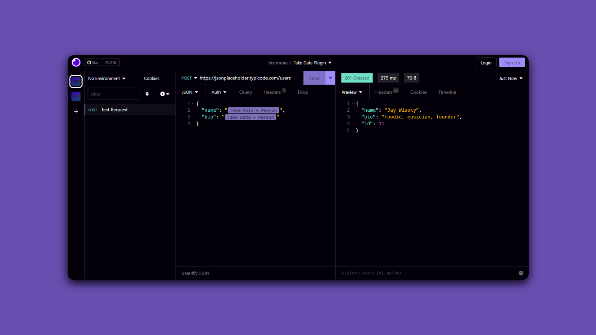
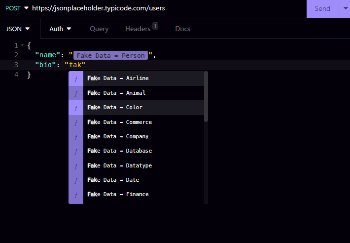
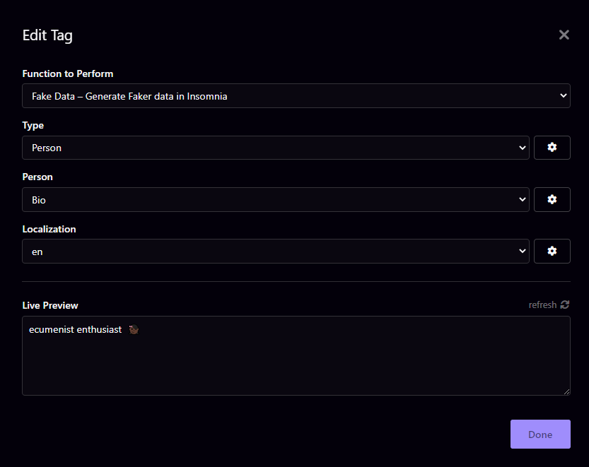

<h3 align="center">
	 
	Quicky Fake Data for Insomnia
</h3>

Generate Faker data right within the Insomnia REST Client!

Looking to populate your insomnia app with realistic and diverse test data?

Want to generate random email addresses that go beyond `'example@email.com'`?

Tired of generic usernames like `'user123'`? Spice it up!

Introducing our Quicky Fake Data for Insomnia - your data diversity solution!

Powered by Faker JS, say goodbye to monotonous data and hello to dynamic names, addresses, emails, and more!

Upgrade your testing experience now! Happy testing! 🐇✨"

----

## Installation

### From Insomnia Plugin Hub

1. Navigate to [https://insomnia.rest/plugins/insomnia-plugin-quicky-fake-data-generation](https://insomnia.rest/plugins/insomnia-plugin-quicky-fake-data-generation)
2. Click _Install Plugin_
3. Click _Open_
4. Once opened, click _Install_

### From the Insomnia App

1. Go to _Application_ > _Preferences_ **or** click the cog icon (⚙️)
2. Navigate to the _Plugins_ tab
3. Enter `insomnia-plugin-quicky-fake-data-generation`
4. Click _Install_

### Manual Install

1. Using a terminal, `cd` into your Insomnia plugins folder - [See Insomnia Docs](https://docs.insomnia.rest/insomnia/introduction-to-plugins)
2. Run `git clone https://github.com/RenerPires/quicky-insomnia-fake-data`

## Usage

Press Ctrl + Space to insert `<Fake Data Option>`

or type `Fake Data` and click on tag

    

Select the parameters to better fit your tests expectations

    

For a complete list of fake data types, refer to the list here: [API Reference](https://fakerjs.dev/api/)

This plugin uses the Faker NPM module to generate "fake" data.

&nbsp;

Copyright &copy; 2023-present

